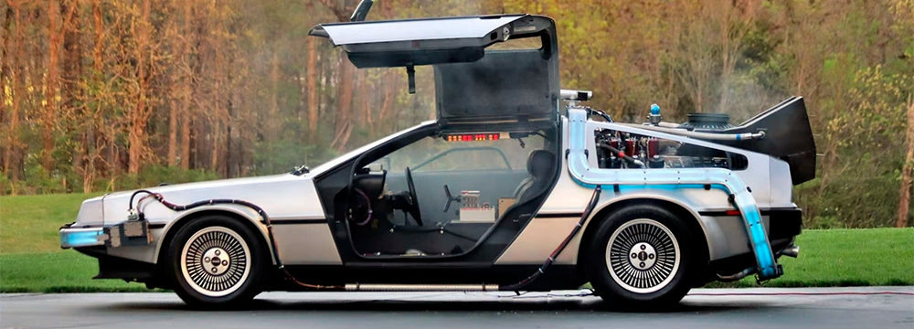

# Car price prediction

Результат:
- [Jupyter_notebook](https://github.com/dmakhazen/portfolio/tree/main/car_price_prediction/car_price_prediction.ipynb)

## Описание проекта

**Описание проблемы**

В сфере покупки и продажи автомобилей существует проблема определения точной цены для каждого конкретного автомобиля. Цена автомобиля зависит от множества факторов, таких как марка, модель, год выпуска, техническое состояние, пробег и другие характеристики. Из-за этой сложности многие автовладельцы и потенциальные покупатели сталкиваются с неопределенностью и неуверенностью в правильности оценки стоимости автомобиля.

**Цель**

Основной целью проекта является разработка модели машинного обучения, которая способна предсказывать цену автомобиля с высокой точностью на основе доступных характеристик. Это позволит упростить процесс продажи и покупки автомобилей, обеспечивая уверенность и прозрачность для всех заинтересованных сторон.

## Ключевые особенности
- Сравнения результатов моделей с OE и OHE кодировками данными с некодированными в моделях catboost и lightgbm. *спойлер - внутренняя кодировка данных в модели оказалась лучше* 

## Инструменты, навыки

Инструменты:
- Pandas
- Numpy
- Sklearn
- Catboost
- LightGBM

Навыки:
- Подготовка данных
- Создание моделей ML

## Результаты
**Модель**

1. Модель построена на основе catboost на данных без кодировки
2. RMSE равно 1441 евро
3. Время обучения 232.6 сек
4. Время предсказания 0.83 сек
5. Модель еще можно улучшить - категоризацию по километражу добавить, возможно преобразвать признаки, поискать новые признаки (например сколько владельцев было, комплектацию машин и т.д)

**Общий вывод**

1. Градиентный бустинг лучший для данного проекта
2. Модель (catboost) обученная на некодированных данных работает чуть лучше, чем модель обученная на кодировке OHE, OE
3. Важность признаков (по убыванию):
    - registration_year
    - power
    - brand
    - vehicle_type
    - kilometer
    - model
    - fuel_type
    - repaired
    - registration_month
    - gearbox
