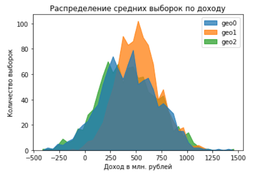

# Taxi orders time series prediction

Результат:
- [Jupyter_notebook](https://github.com/dmakhazen/portfolio/tree/main/oil_location_profit_prediction/oil_location_profit_prediction.ipynb)

## Описание проекта

**Описание процесса**
   
Допустим, вы работаете в добывающей компании «ГлавРосГосНефть». Нужно решить, где бурить новую скважину. Вам предоставлены пробы нефти в трёх регионах: в каждом 10 000 месторождений, где измерили качество нефти и объём её запасов.

**Цель**

Постройте модель машинного обучения, которая поможет определить регион, где добыча принесёт наибольшую прибыль. Проанализируйте возможную прибыль и риски техникой *Bootstrap.*

## Ключевые особенности
- Использование bootstrap

## Инструменты, навыки

Инструменты:
- Pandas
- Matplotlib
- Numpy
- Sklearn

Навыки:
- Анализ данных
- Построение модели
- Анализ экономических показателей

## Результаты
**Поиск региона:**

- Риск убытков для региона 0 равен 5%, средняя прибыль равна 425.93 млн. рублей
- Риск убытков для региона 1 менее 1%, средняя прибыль равна 518.25 млн. рублей
- Риск убытков для региона 2 равен 6%, средняя прибыль равна 420.19 млн. рублей
- Вероятность получения убытка для региона 0 равна 5.9 %
- Вероятность получения убытка для региона 1 равна 0.2 %
- Вероятность получения убытка для региона 2 равна 6.1 %

**Выводы по региону 1:**
- Средняя выручка 10518.25 млн. рублей
- Средняя прибыль равна 518.25 млн. рублей
- Интервал 2,5%->97,5% (0.95 доверительный интервал) соответствует 128.12 и 1953.61 млн. рублей прибыли
- Распределение предсказанных доходов и прибыли отличается от двух других регионов в лучшую сторону

**Вывод общий:**
- Наименее рисковый и наиболее прибыльный регион - номер 1
