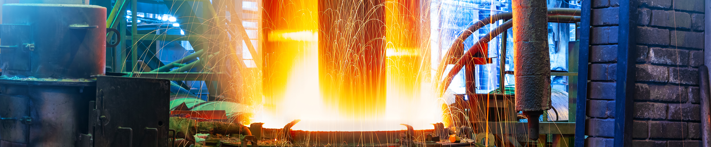

# Steelmaking temperature prediction

Результат:
- [Jupyter_notebook](https://github.com/dmakhazen/portfolio/tree/main/steelmaking/steelmaking_temp_prediction.ipynb)

## Описание проекта

**Описание проблемы**

Чтобы оптимизировать производственные расходы, металлургический комбинат ООО «Так закаляем сталь» решил уменьшить потребление электроэнергии на этапе обработки стали. Значительные траты энергии уходят на увеличение температуры расплава в ковше в процессе добавки ингидиентов в сплав для получения необходимых свойств стали. Процесс добавления - итеративный, в нем есть различные факторы влияющие на температуру предугадать которые сложно (например состояние электродов, качество руды, качество добавок и прочее). Предсказав температуру и проанализировав модель можно получить данные, которые помогут комбинату снизить энергопотребление.

**Цель**

Построить модель предсказывающую температуру стали в ковше. Выбранная метрика - MAE должна быть меньше 6.8 градусов цельсия.

## Ключевые особенности
- Преобразование данных из различных источников
- Поиск лучшей модели среди множества различных моделей
- Использование optuna для поиска гиперпараметров
- Использование shap для анализа модели

## Инструменты, навыки

Инструменты:
- Pandas
- Matplotlib
- Numpy
- Sklearn
- Catboost
- LightGBM
- Shap
- Optuna

Навыки:
- Статистический анализ
- Визуализация
- Создание признаков
- Создание моделей ML
- Подробный анализ модели

## Результаты

1. План работы выполнен полностью
2. Основная проблема была в понимании смысла модели и для какой цели/задач она нужна бизнесу. Решилось на встрече при обсуждении.
3. Ключевые шаги:
    - Понять в чем смысл модели
    - Для достижения цели составить себе список задач
    - Предобработка данных
    - Анализ мультиколлинеарности признаков и масштабирование
    - Обучение и сравнение разных моделей
    - Выбор итоговой модели, подбор гиперпараметров
    - Анализ результатов итоговой модели: метрика, важность признаков в модели, примеры работы модели на объектах
4. В результате получена модель на основе CatboostRegressor, метрика модели на тестовом датасете МАЕ равна 5.52 градусов
5. Признаки используемые в модели (объект - ковш, поэтому в данных агрегировались значения для ковша):
    - Начальная температура сплава в ковше
    - Конечная температура сплава в ковше
    - Суммарная длительность измерения времени
    - Суммарная длительность работы электродов
    - Суммарная активная мощность
    - Значения сумм для каждой добавки отдельно
    - Признаки 'reactive_sum', 'Wire 5', 'Wire 8' - имели сильную корреляцию с другими признаками, удалил их
6. Гиперпараметры {'learning_rate': 0.042546607222914444, 'depth': 5, 'subsample': 0.21435221598889664, 'colsample_bylevel': 0.707551280024054, 'min_data_in_leaf': 24}
7. **Для развития модели в дальнейшем:**
    - Необходима связь с техническим специалистом предприятия
    - Нужно больше признаков: 
        1. итоговый вид сплава
        2. вид ковша
        3. состояние футеровки
        4. состояние электродов
        5. оценки качества руды
        6. подробное описание добавок
        7. больше объектов
    - Как будут получены такие данные, можно лучше оценить целесообрать признаков текущих в модели, обучить её еще раз и сравнить с предыдущей
    - Сделать отдельные модели под каждый сплав
    - Ввести в модель номер бригады которая работает, так можно оценить влияние конкретной бригады на итоговое состояние
    - Сформировать модель классификации для получения факта отхода от предсказанных температур в виде оповещения
    - Самый важный признак - исходная температура, наверно есть возможность моделировать и предшествующий процесс, сделать из него выводы
    - Построенная модель является основанием для работы в различных направления (оценка качества бригад, качества руды, качества электродов и т.д) либо для моделирования температур отдельных сплавов и/или всего процесса в целом

